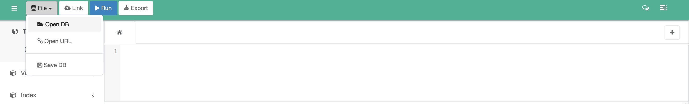

# Titanic (but this time in SQL!)

For this lab, we're going to take a look at the Titanic manifest a second time, using SQL this time. We'll be exploring this data to see what we can learn regarding the survival rates of different groups of people. One benefit to doing this is that it is easy to check your work against your work from the Titanic challenge last week!

## Prework
1. Go to [https://sqliteonline.com/](https://sqliteonline.com/)
2. Upload the `titanic.db` sqlite database found in this repository to the website (screenshot below)
3. Write SQL commands to tackle the problems below, testing them on the table you just uploaded to [https://sqliteonline.com/](https://sqliteonline.com/). Once they work, copy them into a text file that you create in this repository using a text editor of your choice
4. Add and commit your file when you are finished and create a pull request from your fork to the `DSI-EAST-1/lab-sql-1` repository to submit your work.



## Step 1: Cleaning the data
1. Which column has the most `NULL` values? How many cells in that column are empty?
2. Delete all rows where `Embarked` is empty
3. Fill all empty cabins with **¯\\_(ツ)_/¯**

Note: `NULL` is synonymous in SQL to `NaN` in Pandas.

## Step 2: Feature extraction
1.  There are two columns that pertain to how many family members are on the boat for a given person. Create a new column called `FamilyCount` which will be the sum of those two columns.
2. Reverends have a special title in their name. Create a column called `IsReverend`: 1 if they're a preacher, 0 if they're not.
3. Create new dummy variables: 
  - Create 3 columns: `Embarked_C`, `Embarked_Q` and `Embarked_S`. These columns will have 1's and 0's that correspond to the `C`, `Q` and `S` values in the `Embarked` column
  - Do the same thing for `Sex`

## Step 3: Exploratory analysis

For this section, I have provided the answers to 1 and 2 to help you create a survival rate in SQL:

1. What was the survival rate overall?

```sql
SELECT SUM(Survived) / 891.0 FROM titanic;
```

2. Which gender fared the worst? What was their survival rate?

```sql
SELECT SUM(Survived) / 891.0 FROM titanic WHERE Sex = 'female';
SELECT SUM(Survived) / 891.0 FROM titanic WHERE Sex = 'male';
```

3. Which gender fared the worst? What was their survivale rate? Answer this using the `Sex` dummy variables that you created in step 2.
4. What was the survival rate for each `Pclass`?
5. Did any reverends survive? How many?
6. What is the survival rate for cabins marked **¯\\_(ツ)_/¯**
7. What is the survival rate for people whose `Age` is misisng?
8. What is the survival rate for each port of embarkation?
9. What is the survival rate for children (under 12) in each `Pclass`?
10. Did the captain of the ship survive? Is he on the list?
11. Of all the people that died, who had the most expensive ticket? How much did it cost? 
  - Hint: you may want to look into the `ORDER BY` or `MAX()` functionality of SQL (external research required!)
12. Does having family on the boat help or hurt your chances of survival?
