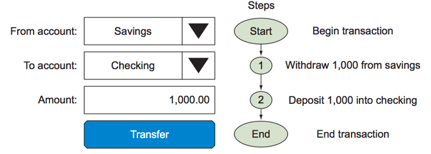
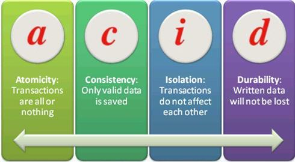
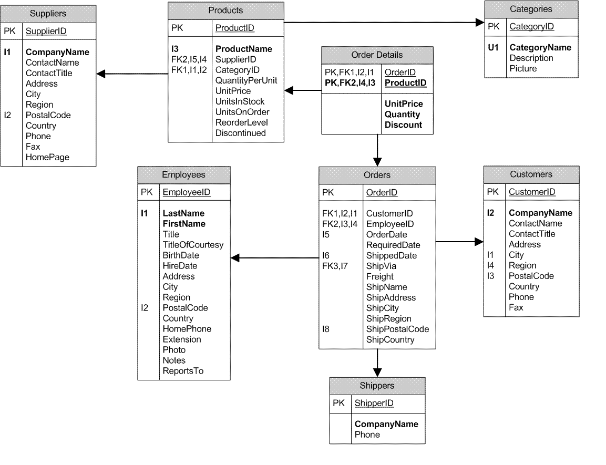

# Intro to SQL

We've so far looked at data held in specific formats (such as comma separated values or `.csv` files) or data that we have input manually. However, on the job we most frequently interact with data held in databases, which allow for replicable and speedy access to large sets of data.

Databases can come in many flavors, designed for different use cases. We will survey a few applications and explore the most common families of databases: relational and non-relational.

In short...

- Databases are computer systems that manage the storage and querying of data.
- Databases provide a way to organize data along with efficient methods to retrieve specific information.
- Databases also allow users to create rules that ensure proper data management and verification.

Typically, retrieval is performed using a query language the most common of which is SQL (Structured Query Language).

## Intro to Relational Databases

The most frequently used type of databases is a relational database. Here, data is kept on several different `tables` and is joined together as needed through the use of `primary keys` and `foreign keys`. This is known as [database normalization](https://en.wikipedia.org/wiki/Database_normalization) (not to be confused with other forms of normalization, which we'll discuss later!). Splitting data up this way has several benefits, namely minimizing the number of places in which data needs to be modified when it is created, updated, or deleted.

## Transactional Integrity 

One thing that we want to ensure is `transactional integrity` -- that every transaction is a valid transaction and that every transaction is completed correctly. 

For example, databases are very commonly used at banks. A bank needs to keep track of all the money in each of its clients' accounts. Let's suppose that the bank stores these as numbers in a table with two columns:

| ACCOUNT_ID | BALANCE |
|---|---|
| 1 | 10.000 |
| 2 | 12.546 |
| 3 | 8761 |
|...|...|

As you may know, when multiple processes/users are interacting with the same data, it quickly becomes impractical to store it in a single file on a single machine. That's where databases comes in.

A unit of work performed against a database is called a _transaction_. This term generally represents any change in database.

Going back to the bank example, consider the case where you want to transfer money from an account to another.



The system that stores the data must be resilient to these problems. It must know when a transaction begins, when it ends, what to do if it never ends and what to do if another transaction is requested, while the previous one is still going.

### Guaranteeing Transaction Reliability



There is a set of properties known by the acronym *[ACID](https://en.wikipedia.org/wiki/ACID)* that guarantee that database transactions are processed reliably and concurrently:

* Atomicity
* Consistency
* Isolation
* Durability.

_Atomicity_ requires that each transaction be "all or nothing": if one part of the transaction fails, the entire transaction fails, and the database state is left unchanged.

_Consistency_ ensures that any transaction will bring the database from one valid state to another. Any data written to the database must be valid according to all defined rules, including constraints, cascades, triggers, and any combination thereof.

_Isolation_ ensures that the concurrent execution of transactions results in a system state that would be obtained if transactions were executed serially, i.e., one after the other.

_Durability_ ensures that once a transaction has been committed, it will remain so, even in the event of power loss, crashes, or errors. In a relational database, for instance, once a group of SQL statements execute, the results need to be stored permanently (even if the database crashes immediately thereafter)

Typical relational databases ensure that they are **ACID**.

### Relational Databases

A relational database is a database based tabular data and links between data entities or concepts. Typically, a relational database is organized into tables. Each table should correspond to one entity or concept. Each table is similar to a single CSV file or Pandas dataframe.

For example, let's take a sample application like Twitter. Our two main entities are Users and Tweets. For each of these we would have a table.

A table is made up rows and columns, similar to a Pandas dataframe or Excel spreadsheet. A table also has a schema which is a set of rules for what goes in each table, similar to the header in a CSV file. These specify what columns are contained in the table and what type those columns are (text, integers, floats, etc.).

The addition of type information make this constraint stronger than a CSV file. For this reason, and many others, databases allow for stronger data consistency and often are a better solution for data storage.

Each table typically has a `primary key` column. This column is a unique value per row and serves as the identifier for the row.

A table can have many `foreign key`s as well. A `foreign key` is a column that contains values to link the table to the other tables. For example, the tweets table may have as columns:

- tweet_id, the primary key tweet identifier
- the tweet text
- the user id of the member, a foreign key to the users table

These keys that link the table together define the relational database.

MySQL and PostgreSQL are popular implementations of relational databases. Both of these are open-source, available for free, and are widely-used in industry.

Alternatively, many larger companies may use Oracle or Microsoft SQL databases. While these all offer many of the same features (and use SQL as a query language), the latter also offer some maintenance features that large companies find useful.

#### A quick note on "Schemas"

The term "schema" can mean different things depending on which flavor of database you are talking about (MySQL, Postgres, Oracle, MSSQL). Generally, the definition that we will accept for this class is:

A schema is a collection of database objects which includes logical structures, such as:

- Databases
- Tables
- Relationships between Tables
- Keys and Indexes



## Design a relational database

Group up together in groups of 3-5 and try and design a relational databases from Lyft with the following fields:

- User ID
- User Name
- Driver ID
- Driver Name
- Ride ID
- Ride Time
- Pickup Longitude
- Pickup Latitude
- Pickup Location Entity
- Drop-off Longitude
- Drop-off Latitude
- Drop-off Location Entity
- Miles
- Travel Time
- Fare
- CC Number

Make sure that you diagram / answer the following:

- How would you design a relational database to support this data?
- List the tables you would create
- What fields would they contain?
- How would they link to other tables?

## Non-Relational Databases

While relational tables are one of the most popular (and broadly useful) database types, specific applications may require different data organization. While it's not important to know all varieties, it is good to know the overall themes:

### Key-value stores

Some databases are nothing more than very-large (and very-fast) hash-maps or dictionaries that can be larger than memory. These are useful for storing key based data, i.e. storing the last access or visit time per user, or counting things per user or customer.

Every entry in these databases is two values, a key and value, and we can retrieve any value based on its key. This is exactly like a python dictionary, but can be much larger than your typically computer memory allows and uses smart caching algorithms to ensure frequently or recently accessed items are quickly accessible.

Popular key-value stores include Cassandra, Redis or memcachedb.

Key-value stores are typically used for: image stores, key-based filesystems, object cache, systems designed to scale.

### NoSQL or Document databases

NoSQL databases don't rely on a traditional table setup and are more flexible in their data organization. Typically they do actually have SQL querying abilities, but simply model their data differently.

Many organize the data on an entity level, but often have denormalized and nested data setups. For example, for each user, we may store their metadata, along with a collection of tweets, each of which has its own metadata. This nesting can continue down encapsulating entities. This data layout is similar to that in JSON documents.

Popular databases of this variety include mongodb and couchdb.

Typical uses: high-variability data, document search, integration hubs, web content management, publishing, and many more.

Industry example

Consider the case of large ecommerce website. There is a catalogue with many products. Every product needs to be stored in a database, but different products could have different properties. Also, inventory needs to be tracked, and user carts affect inventory.

### Timeseries databases

Time series databases (TSDB) are optimized for handling time series data, i.e. data that is indexed by time (a datetime or a datetime range).

Examples of time series include stock market data, energy load data from a utility company, server metrics, purchase history, website metrics, ads and clicks, sensor data from a wearable device or an internet-of-things sensor, and smartphone sensor data

Time series pose different challenges that cannot be usually solved with the traditional relational database model.

Popular databases of this variety include: Atlas, Druid, InfluxDB, Splunk

### Graph databases

Graph databases are optimized to store data about networks. Most graph databases are NoSQL in nature and store their data in a key-value store or document-oriented database. In general terms, they can be considered to be key-value databases with the addition of the relationship concept.

In traditional relational databases, the relationships are defined within the data itself. In graph databases, relationships allow the values in the store to be related to each other in a free form way. This allows complex hierarchies to be quickly traversed, addressing one of the more common performance problems found in traditional key-value stores.

Most graph databases also add the concept of tags or properties, which are essentially relationships lacking a pointer to another document.

Popular databases of this variety include: Neo4j, OpenCog, AllegroGraph, Oracle Spatial and Graph.

Typical uses: social networks, fraud detection, and relationship-heavy data.

Industry example

Consider a phone company that has information about phone calls. Each phone call entity has the following properties:

- caller_id
- receiver_id
- time_of_call
- duration

Each user makes many calls, and some users may be more connected than others. The company is interested in finding the people that are central in the network of call connections (super connectors), in order to extend them a promotion on their phone usage. The reason for doing this is that they want them to be happy with the company and positively influence the brand image to their connections.

A graph database is perfectly suited to answer such a question.

Other examples could include

- finding communities
- finding shortest path between two entities
- detecting fraudolent behavior
- establishing user identity

#### BASE (Basically Available, Soft state, Eventual consistency)

An alternative to ACID is BASE and is typically associated with NoSQL databases. The acronym stands for:

- Basically available indicates that the system does guarantee availability.
- Soft state indicates that the state of the system may change over time, even without input.
- Eventual consistency indicates that the system will become consistent over time, given that the system doesn't receive input during that time.

Main concept: get rid of locks, allow everyone to write, worry about consistency later.

## Connecting to and Using Databases

A database can be local or remote, it can span a single machine or it can be distributed with replicated data over several machines. The latter configuration is called sharding.

Let's start by using a type of relational database known as SQLite to practice basic SQL commands.

### SQLite

SQLite is a database software package built on the Structured Query Language (SQL). It is similar to other SQL databases, such as PostgreSQL, MySQL, Oracle, and Microsoft SQL Server, except that it is file-based, rather than server-based. This makes it easy to setup and use for small projects, but less suitable for production environments. Once you are familiar with sqlite, the same ideas, and similar syntax, can be applied to other SQL databases.

SQLite is bundled with most Python distributions (including Anaconda) but to make things easier, we'll use an online version [https://sqliteonline.com/](https://sqliteonline.com/) instead.

## Common SQL Command Patterns

The SQL command set has a rich syntax with numerous options, but most of the commonly used commands follow a few simple patterns. A basic familiarity of these patterns is helpful when working in SQL:

```sql
CREATE TABLE ...
ALTER TABLE ... ADD COLUMN ...
INSERT INTO ... VALUES ...
UPDATE ... SET ... WHERE ...
SELECT ... FROM ... WHERE ...
SELECT ... FROM ... JOIN ... ON ...
DELETE FROM ... WHERE ...
```

Note that capital letters for commands are not required for SQL, but some people prefer them for visual clarity. Capital letters versus lowercase letters for SQL can be an example of [bikeshedding](https://en.wikipedia.org/wiki/Law_of_triviality).

### Creating tables and adding columns

Create an table called table1 with a single column field1 containing an INTEGER PRIMARY KEY:

```sql
CREATE TABLE table1 (field1 INTEGER PRIMARY KEY);
```

Add a few more columns to table1:

```sql
ALTER TABLE table1 ADD COLUMN field2 VARCHAR(16);
ALTER TABLE table1 ADD COLUMN field3 REAL;
ALTER TABLE table1 ADD COLUMN field4 TEXT;
```

Notice the different field types in the ALTER TABLE commands. SQLite supports several different field types, including INTEGERS, variable length VARCHAR character fields (with a max length), TEXT fields, and 'REALS', which are used to store floating point numbers.

> Note this is unlike Python, where we _do not have to establish a type for variables first_ -- whether or not your language is **typed** or not can be a very big distinction when comparing languages!

### Adding data

Let's add some data:

```sql
INSERT INTO table1 VALUES (1, 'Henry James', 42, '75 Mission Street, San Francisco, CA');
INSERT INTO table1 VALUES (2, 'Carol James', 40, '75 Mission Street, San Francisco, CA');
INSERT INTO table1 VALUES (3, 'Jesse James', 12, '75 Mission Street, San Francisco, CA');
```

Notice that the first column has unique values - this is a requirement for the PRIMARY KEY column. If we try to add a record using an existing PK value we'll get an error:

```sql
INSERT INTO table1 VALUES (3, 'Julie James', 10, '75 Mission Street, San Francisco, CA');
```

Fortunately, SQLite has some built in functionality to auto-increment the PK value - just set the value of the PK field to NULL when doing the INSERT and it will automatically be set to a valid value.

```sql
INSERT INTO table1 VALUES (NULL, 'Julie James', 10, '75 Mission Street, San Francisco, CA');
```

### Viewing records

`SELECT` is the keyword to access information in SQL. Here are some use cases:

```sql
SELECT * FROM table1;
```

`SELECT` requires the columns that you wish to see, followed by the table containing those columns (after `FROM`). `SELECT *` will select all the columns in a given table. By default, every row in the table will be returned.

```sql
SELECT field1, field2 FROM table1;
```

To see specific columns from a table, include them after `SELECT`. It's usually helpful (from a performance perspective) to select only the columns that you actually need from a table.

```sql
SELECT field1, field2 FROM table1 LIMIT 5;
```

To limit the number of rows that SQL returns, end your command with `LIMIT` and the number of rows you would like to see. This is equivalent to calling `.head()` in Pandas -- it will show the top N rows.

```sql
SELECT field1, field2 FROM table1 WHERE field1 = 'Julie James';
SELECT field1, field2 FROM table1 WHERE field3 >= 10;
SELECT * from table1 WHERE field3 IS NULL;
```

To filter rows on some criteria, include the `WHERE` keyword after the table name. After `WHERE`, include the column name and a comparison, nothing the following:

- In SQL, there is no `==` -- use `=` for equality only
- To filter by null / not null, use `IS NULL` or `IS NOT NULL`
- Make sure to check for other cases that are not coded as missing data but may still represent missing data, such as empty spaces or improbable values like `-999999`

### Updating records

Suppose we need to update an existing record with new data - e.g. maybe Julie James is only 9. For this we use the UPDATE command:

```sql
UPDATE table1 SET field3=9 WHERE field1=4;
```

### Removing records

To remove records use the DELETE command:

```sql
DELETE FROM table1 WHERE field2 like '%Jesse%';
```

# More Practice

For extra practice using SQL, one fantastic resource is [SQLZoo](https://sqlzoo.net/)!