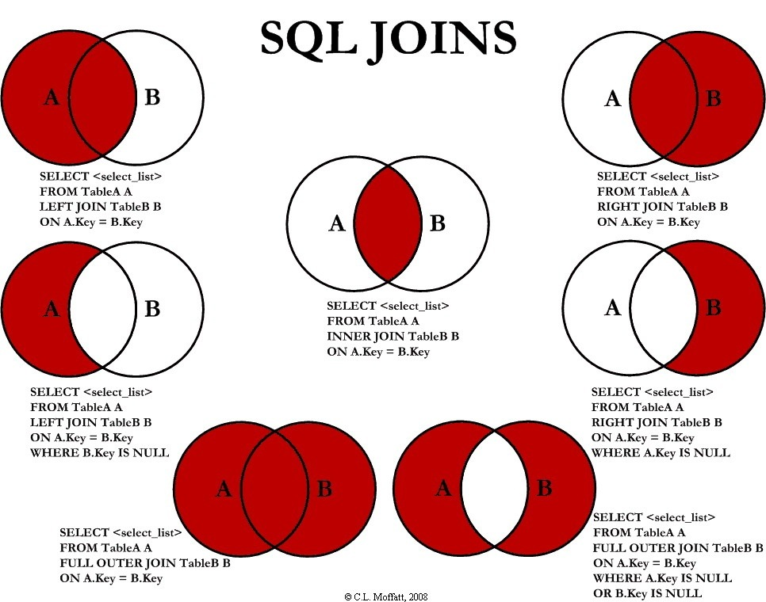

# Advanced SQL Concepts

In this lecture we'll learn a few more useful `SQL` commands that will give us the ability to perform more complex queries.

In particular we will learn to:
- Modify / aggregate results in single tables using aggregations like `SUM` and `COUNT`
- Sort results by a column using `ORDER BY`
- Join tables together using `JOIN`
- Simplify our syntax using aliases
- Match patterns using `LIKE`
- Select distinct items using `DISTINCT`
- Aggregate values using `GROUP BY`
- Filter on aggregations using `HAVING`

For all the following example we will use the well-known [Northwind sample database](https://northwinddatabase.codeplex.com/).

This database is located within this repository under `northwind.db` -- just like yesterday, we will upload the Northwind database to [https://sqliteonline.com/](https://sqliteonline.com/) and practice SQL techniques there. 

We will use a few tables from this database:

`customers`:

|CustomerID |CompanyName |ContactName | ContactTitle |Address|City | Region | PostalCode | Country |Phone | Fax|
|---|---|---|---|---|---|---|---|---|---|---|
|ALFKI| Alfreds Futterkiste| Maria Anders | Sales Representative | Obere Str. 57 | Berlin|| 12209| Germany | 030-0074321| 030-0076545|
|ANATR| Ana Trujillo Emparedados y helados | Ana Trujillo | Owner| Avda. de la Constitución 2222 | México D.F. || 05021| Mexico| (5) 555-4729 | (5) 555-3745|
|ANTON| Antonio Moreno Taquería| Antonio Moreno | Owner| Mataderos2312 | México D.F. || 05023| Mexico| (5) 555-3932 |
|...|...|...|...|...|...|...|...|...|...|...|

`orders`:

|OrderID | CustomerID | EmployeeID | OrderDate| RequiredDate | ShippedDate | ShipVia | Freight | ShipName|ShipAddress |ShipCity| ShipRegion | ShipPostalCode | ShipCountry |
|---|---|---|---|---|---|---|---|---|---|---|---|---|---|
|10248 | VINET|5 | 1996-07-04 | 1996-08-01 | 1996-07-16| 3 | 32.38 | Vins et alcools Chevalier | 59 rue de l'Abbaye | Reims|| 51100| France|
|10249 | TOMSP|6 | 1996-07-05 | 1996-08-16 | 1996-07-10| 1 | 11.61 | Toms Spezialitäten| Luisenstr. 48| Münster|| 44087| Germany|
|10250 | HANAR|4 | 1996-07-08 | 1996-08-05 | 1996-07-12| 2 | 65.83 | Hanari Carnes | Rua do Paço, 67| Rio de Janeiro | RJ | 05454-876| Brazil|
|...|...|...|...|...|...|...|...|...|...|...|

`order_details`:

| OrderID |  ProductID |  UnitPrice | Quantity | Discount |
| --- |---|---|---|---|
|10248|11|14|12|0|
|10248|42|9.8|10|0|
|10248|72|34.8|5|0|
|10249|14|18.6|9|0|
|10249|51|42.4|40|0|
|10250|41|7.7|10|0|
|...|...|...|...|...|

## Aggregating Results

Aggregations (or aggregate functions) are functions in which the values of multiple rows are grouped together as an input on certain criteria to form a single value of more significant meaning or measurement. 

Aggregate funtions in sqlite include:

- Average (`AVG()`) -- returns the average value of the column over the selected rows
- Count (`COUNT()`) -- returns the count of rows within that column
- Maximum (`MAX()`) -- returns the largest value of the column within the selected rows
- Minimum (`MIN()`) --  returns the smallest value of the column within the selected rows
- Sum (`SUM()`) -- returns the sum of all values in the column over the selected rows

Note that different dialects of SQL may have additional (or different!) ways to aggregate

_Aggregating with a single table and column_

Examples include:

```sql
SELECT AVG(freight) FROM orders;
SELECT COUNT(freight) FROM orders;
SELECT MAX(freight) FROM orders;
SELECT MIN(freight) FROM orders;
SELECT SUM(freight) FROM orders;
```

Notice that we put in a specific column name into the aggregating function (with the exception of count, which can take `*` as well!)

> Note: you will get errors if you include a column passed into an aggregator and a column that is not. We'll discuss ways to avoid this problem later on in this lecture.

**Check for Understanding**: In the `products` table is a field for `unitsinstock`, which is the number of items of that category that are currently in stock. How would you find the average, maximum, minimum and total number of items in stock? How many tems exist in the `products` table overall?

## Ordering Results

We can order our results in descending or asecnding fashion by using the `ORDER BY` keyword. By default, `ORDER BY` will order the results from smallest to largest (or, if the column is a string type, from A to Z). To change this, add `DESC` (for descending) after the column. The following SQL statement selects all customers from the "Customers" table, sorted in descending order by the "Country" column:

```sql
SELECT customerid, companyname, country FROM customers
ORDER BY country DESC;
```

|CustomerID|CompanyName|Country|
|---|---|---|
|GROSR|GROSELLA-Restaurante |Venezuela|
|LILAS|LILA-Supermercado|Venezuela|
|HILAA|HILARION-Abastos |Venezuela|
|...|...|...|

#### `ORDER BY` Several Columns Example

The following SQL statement selects all customers from the `customers` table, sorted by the country and the companyname columns:

```sql
SELECT customerid, companyname, country FROM customers
ORDER BY country, companyname;
```

|CustomerID|CompanyName|Country|
|---|---|---|
|CACTU|Cactus Comidas para llevar|Argentina|
|OCEAN|Océano Atlántico Ltda.|Argentina|
|RANCH|Rancho grande |Argentina|
|...|...|...|

**Check for Understanding**: In the `products` table, use `ORDER BY` and `LIMIT` to show the top five most expensive products. Include only the product name, quantity per unit, and price.

## Joining Tables 

We will join tables together when data is spread out in different tables. A `JOIN` operation allows us to combine rows from two or more tables in a single new table. In order for this to be possible, a common field need to exists between the tables. 

Typically this common field is the primary key of one table and stored in an additional column in another table as a foreign keys. 

However, there are many times where not every row will be linked to each other (either they will have no value for that joining key or the key will not be found in the partner table). We have different forms of `JOIN` depending on what we want to do with those rows that do not have a match.

JOIN types include:
- INNER JOIN: Returns all rows where there is at least one match in BOTH tables.
- LEFT JOIN: Returns all rows from the left table and matched rows from the right table.
- RIGHT JOIN: Returns all rows from the right table and matched rows from the left table.
- FULL JOIN: Returns all rows where there is a match in ONE of the tables.



```sql
SELECT employees.firstname, employees.lastname, orders.orderdate
FROM orders
INNER JOIN employees ON orders.employeeid = employees.employeeid
ORDER BY orders.orderdate DESC
LIMIT 25;
```

> Note: [https://sqliteonline.com/](https://sqliteonline.com/#) currently does not support right or outer joins, but a right join is the same thing as a left join with the table order reversed.

**Check for Understanding**: The `products` table has foreign keys for both the `categories` and the `supplier` table. In groups, discuss the following:

1. What type of join would be appropriate to join `products` to each of those two tables
2. Would each join be a 1:1 join (i.e., each pairing is unique) or a many to one join, where a row in one table may be joined to multiple rows in another table? 
    - An example of a many to one join would be an authors table and a tweet table in Twitter -- one author makes many tweets so the *author* information will be joined to multiple rows in the tweet table. Assuming that people tweet more than once, of course!

## Simplifying Queries with Aliases

SQL aliases are used to give a database table, or a column in a table, a temporary name. Aliases are often created to make column names more readable.

#### Alias Examples for Table Columns

The following SQL statement specifies two aliases, one for the `CompanyName`  column and one for the `ContactName` column:

```sql
SELECT companyname AS customer, contactname AS contact
FROM customers;
```

|customer|contact|
|---|---|
|Alfreds Futterkiste| Maria Anders|
|Ana Trujillo Emparedados y helados| Ana Trujillo|
|Antonio Moreno Taquería| Antonio Moreno|
|...|...|

#### Alias Example for Tables

The following SQL statement selects all the orders from the customer with CustomerID=4 (Around the Horn). We use the `customers` and `orders` tables, and give them the table aliases of `c` and `o` respectively. (This time we used aliases to make the SQL shorter.)

```sql
SELECT o.orderid, o.orderdate, c.companyname
FROM customers AS c, orders  AS o  
WHERE c.companyname = 'Around the Horn' AND c.customerid=o.customerid;
```

|customerid|orderdate|companyname|
|---|---|---|
|10355|1996-11-15|Around the Horn|
|10383|1996-12-16|Around the Horn|
|10453|1997-02-21|Around the Horn|
|10558|1997-06-04|Around the Horn|
|...|...|...|

Aliases can be useful when:

- More than one table is involved in a query
- Functions are used in the query
- Column names are long or not very readable
- Two or more columns are combined together

**Check for Understanding**: Create a query of your choice, using at least 1) a join to a second table, 2) aliases for the table names, and 3) aliases for the columns you have chosen to view.

## Matching Patterns in Text Using `LIKE`

The following SQL statement selects all customers with a City starting with the letter "S":

```sql
SELECT * FROM customers
WHERE city LIKE 'S%';
```

|CustomerID |CompanyName |ContactName | ContactTitle |Address|City | Region | PostalCode | Country |Phone | Fax|
|---|---|---|---|---|---|---|---|---|---|---|
|BLONP| Blondesddsl père et fils|Frédérique Citeaux|Marketing Manager| 24, place Kléber|Strasbourg||67000| France|88.60.15.31|88.60.15.32|
|COMMI| Comércio Mineiro|Pedro Afonso|Sales Associate|Av. dos Lusíadas, 23|Sao Paulo| SP|05432-043| Brazil|(11) 555-7647| 
|FAMIA| Familia Arquibaldo|Aria Cruz| Marketing Assistant | Rua Orós, 92|Sao Paulo| SP|05442-030| Brazil|(11) 555-9857| 
|...|...|...|...|...|...|...|...|...|...|...|

**Tip:** The "%" sign is used to define wildcards (missing letters) both before and after the pattern. Also notice that `PostgreSQL` is case sensitive.

The following SQL statement selects all customers with a City ending with the letter "s":

```sql
SELECT * FROM customers
WHERE city LIKE '%s';
```

|CustomerID |CompanyName |ContactName | ContactTitle |Address|City | Region | PostalCode | Country |Phone | Fax|
|---|---|---|---|---|---|---|---|---|---|---|
|CACTU| Cactus Comidas para llevar|Patricio Simpson|Sales Agent|Cerrito 333 |Buenos Aires||1010|Argentina| (1) 135-5555|(1) 135-4892|
|DUMON| Du monde entier|Janine Labrune|Owner| 67, rue des Cinquante Otages|Nantes||44000| France|40.67.88.88| 40.67.89.89|
|FRANR| France restauration|Carine Schmitt|Marketing Manager| 54, rue Royale|Nantes||44000| France|40.32.21.21| 40.32.21.20|
|...|...|...|...|...|...|...|...|...|...|...|

Using the NOT keyword allows you to select records that do NOT match the pattern. The following SQL statement selects all customers with Country NOT  containing the pattern "land":

```sql
SELECT * FROM customers
WHERE "country" NOT LIKE '%land%';
```
|CustomerID |CompanyName |ContactName | ContactTitle |Address|City | Region | PostalCode | Country |Phone | Fax|
|---|---|---|---|---|---|---|---|---|---|---|
|ALFKI| Alfreds Futterkiste|Maria Anders|Sales Representative|Obere Str. 57| Berlin||12209| Germany|030-0074321| 030-0076545|
|ANATR| Ana Trujillo Emparedados y helados|Ana Trujillo|Owner| Avda. de la Constitución 2222| México D.F.|| 05021| Mexico|(5) 555-4729|(5) 555-3745|
|ANTON| Antonio Moreno Taquería|Antonio Moreno|Owner| Mataderos|2312 México D.F.|| 05023| Mexico|(5) 555-3932|
|...|...|...|...|...|...|...|...|...|...|...|

**Check for Understanding**: How would you find all products beginning with `M`? How many are there? Can you do this in one query?

## Selecting Distinct Items Using `DISTINCT`

The `SELECT DISTINCT` statement is used to return only distinct (unique) values. In a table, a column may contain many duplicate values; and sometimes you only want to list the different (distinct) values.

#### SELECT DISTINCT Example

The following SQL statement selects only the distinct values from the city columns from the customers table:

```sql
SELECT DISTINCT city FROM customers;
```

| city|
|---|
|Leipzig|
|London|
|Nantes|
|...|

We'll use this much more in the next section.

## Aggregating Values Using `GROUP BY`

`GROUP BY` is one of the most useful constructions that you will see in SQL. We use group by to perform aggregations over certain sub groups. 

**Key rule**: any column you select during a `GROUP BY` function must either: 
1. Be one of the group by columns
2. Have some sort of aggregating function attached to it. In sqlite, those are:
    - Average (`AVG()`)
    - Count (`COUNT()`)
    - Max (`MAX()`)
    - Min (`MIN()`)
    - Sum (`SUM()`)

We select the column we want to aggregate on and the function.

In order to calculate the total amount of items in a specific order we can use the following query:

```sql
SELECT orderid, SUM(quantity)
FROM order_details
GROUP BY orderid
```

Additionally, we might do something like the following:

```sql
SELECT discontinued, COUNT(discontinued), COUNT(distinct supplierid)
FROM products
GROUP BY discontinued;
```

This ties in together the `DISTINCT` keyword from before and shows us the number of unique suppliers for each of the discontinued statuses. 

**Check for Understanding**: Create a group by on `companyname` from the `shippers` table -- you will need to also join `shippers` to the products table. 

## Filtering on Aggregating Queries Using `HAVING`

`HAVING` allows you to filter based on the **results** of an aggregate function. Let's consider the previous example where we aggregated the `Quantity` of an order. What if we would like to filter the results for orders where the total number of items is greater than 100?

```sql
SELECT orderid, SUM(quantity), MAX(discount)
FROM order_details
GROUP BY orderid
HAVING SUM(quantity) > 100;
```

|OrderID|sum|max|
|---|---|---|
|10501|20|0|
|10295|4|0|
|10827|36|0|

## Independent Practice

Now that you've learned many more commands, try combining them:

- Retrieve the top 3 orders by number of items ordered
- Retrieve the oldest 5 orders
- Retrieve the 5 most recent orders. Nest that query into another one that ranks these 5 orders by shipping country (alphabetical order)
- Try some queries on your own
